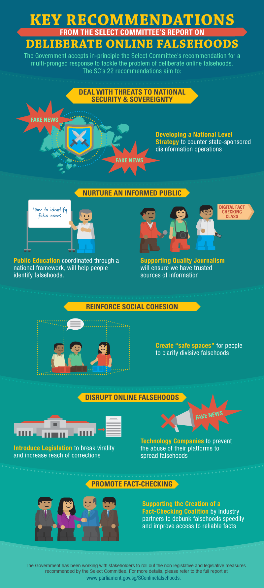

# Information about POFMA

The Protection from Online Falsehoods and Manipulation Act (POFMA) was passed by Parliament on 8 May 2019 and assented to by the President on 3 June 2019. It came into force on 2 October 2019 by notification in the Gazette. 

      <iframe width="560" height="315" src="https://www.youtube.com/embed/aFLHEu74ivw" frameborder="0" allow="autoplay; encrypted-media" allowfullscreen></iframe>

See the resources below for more information on POFMA: 

1. [How POFMA Applies](https://app.mlaw.gov.sg/files/news/others/HowPOFMAApplies.pdf)
2. [POFMA Brochure](https://app.mlaw.gov.sg/files/news/others/POFMABrochure.pdf)
3. [FAQs on POFMA and its scope](https://app.mlaw.gov.sg/files/news/others/POFMA-FAQs.pdf)

# Background to POFMA
Today, many people and groups produce online falsehoods to mislead others. These online falsehoods can affect lives and harm society.

The Protection from Online Falsehoods and Manipulation Act (POFMA) implements recommendations unanimously made by the [Select Committee on Deliberate Online Falsehoods](https://www.parliament.gov.sg/sconlinefalsehoods), which had consulted widely with Singaporeans and international experts. Legislation is necessary, but not sufficient. Informed and alert Singaporeans remain the first line of defence against online falsehoods.

The suite of countermeasures recommended by the Select Committee covers five broad areas, as follows: 

# Other Resources
[Factually](https://www.gov.sg/factually): Government fact-checking website provides accurate information on government policies and related issues

